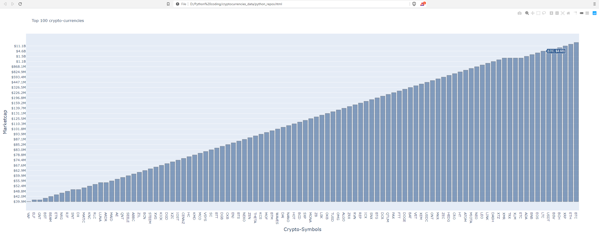

# Data of top 100 cryptocurrencies
# file:///D:/Python%20coding/cryptocurrencies_data/python_repos.html , copy paste for OfflineLink
Webscrapped CoinMarketCap for the data I needed using beautiful soup. I then turned the data into a Csv file
 
I then needed to convert the data into as less digits as possible to fit 100 cryptocurrencies worth of data into a chart.
The decided to graph it with a bar chart to fit it all inside. The Y-axis is missing some marketcap digits. However, if you 
click in the crypto youll see the exact Marketcap everytime.
 
 
